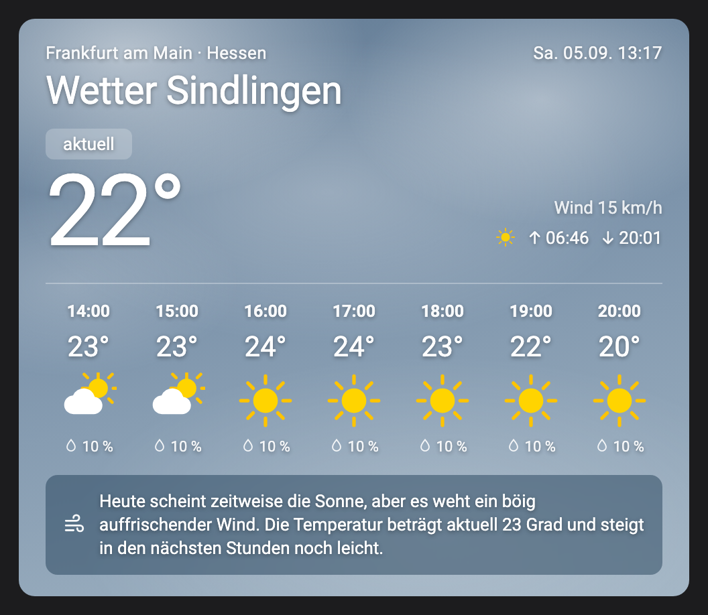
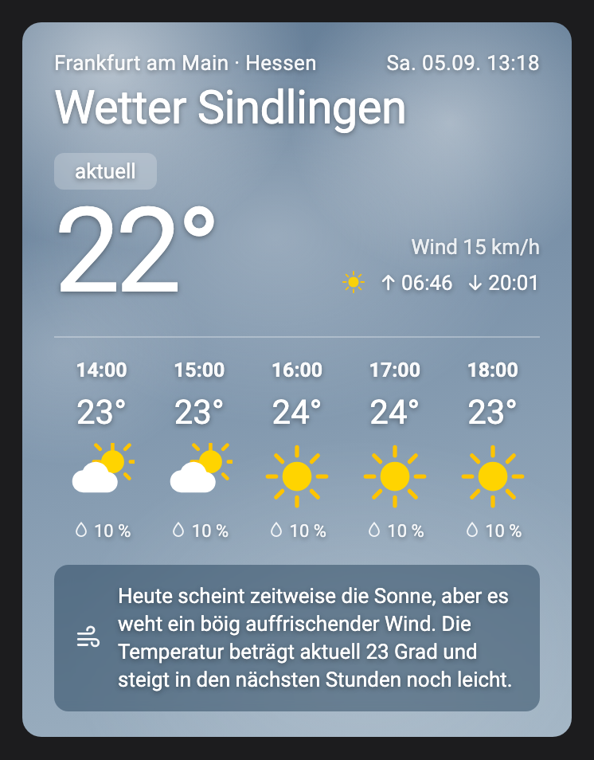

# WetterOnline Card

*English · [Deutsch](README_de.md)*

A Lovelace card for Home Assistant showing current conditions and an hourly
forecast from [wetteronline.de](https://www.wetteronline.de) — without ads,
without a cookie banner and without an iframe.

The card fetches its data directly in the browser and therefore needs **no
integration, no entity and no REST sensor** in Home Assistant.

> **Coverage:** WetterOnline is a German weather service covering Germany,
> Austria and Switzerland in detail. The card's own labels are in German
> (`Wetter <place>`, `aktuell`, abbreviated weekday names), as is the daily
> summary text supplied by the API.

| Wide (7 hours) | Narrow (5 hours) |
|:--:|:--:|
|  |  |

The card adapts to the width of its dashboard column; use `hours` to control how
many hours the forecast strip shows.

## What the card shows

- Current temperature, place, region and timestamp
- Sunrise and sunset
- Current wind speed
- Hourly forecast with weather symbol, temperature and chance of rain
- A daily summary banner
  (e.g. *„Heute scheint zeitweise die Sonne, aber später weht ein böig auffrischender Wind."*)

Background and symbols adapt to cloud cover and time of day — at night the sun
becomes a moon.

## Installation

### HACS (recommended)

1. In HACS, open **⋮ → Custom repositories**
2. Add the repository `ma-world/wetteronline-card`, category **Dashboard**
3. Download **WetterOnline Card**
4. Hard-reload your browser (`Ctrl`/`Cmd` + `Shift` + `R`)

### Manual

1. Copy `wetteronline-card.js` into `config/www/`
2. In Home Assistant go to **Settings → Dashboards → ⋮ → Resources** and add a
   new resource:
   - URL: `/local/wetteronline-card.js`
   - Type: **JavaScript module**
3. Hard-reload your browser

## Configuration

```yaml
type: custom:wetteronline-card
api_key: "YOUR_KEY"
location_id: a6571
latitude: 50.08125
longitude: 8.51625
grid_latitude: "50.10"
grid_longitude: "8.48"
name: Sindlingen
region: Frankfurt am Main · Hessen
hours: 7
update_interval: 600
```

You have to obtain `api_key` and `location_id` yourself — see the next section
for how. Without `api_key` the API responds with `403`.

| Option            | Type    | Default     | Description |
|-------------------|---------|-------------|-------------|
| `api_key`         | string  | —           | **Required.** Client key for the WetterOnline API (see below) |
| `location_id`     | string  | —           | **Required.** WetterOnline location identifier (see below) |
| `latitude`        | number  | —           | Latitude of the place |
| `longitude`       | number  | —           | Longitude of the place |
| `grid_latitude`   | string  | `latitude`  | Latitude of the forecast grid point |
| `grid_longitude`  | string  | `longitude` | Longitude of the forecast grid point |
| `altitude`        | number  | `100`       | Elevation in metres |
| `name`            | string  | —           | Place name in the heading (`Wetter …`) |
| `region`          | string  | —           | Text in the top left, e.g. the state |
| `hours`           | number  | `7`         | Number of hours in the forecast strip |
| `show_sun`        | boolean | `true`      | Show sunrise and sunset |
| `show_text`       | boolean | `true`      | Show the daily summary banner |
| `update_interval` | number  | `600`       | Seconds between API requests, minimum 60 |

### About the update interval

Data is fetched once when the view opens and then on the `update_interval`
schedule. Leaving the view stops the timers; returning to it reloads immediately.
The clock in the card header refreshes every 30 seconds, which costs no
additional request.

Values below 60 seconds are raised to 60. Fetching happens in **every** browser
that has the dashboard open, so a very short interval multiplies across all your
devices.

## Obtaining the credentials

This repository deliberately ships **no API key**. You read it out of the
WetterOnline website yourself — together with your location's coordinates, the
snippet below hands you the complete, ready-to-paste YAML block.

1. Open [wetteronline.de](https://www.wetteronline.de), search for your location
   and open its weather page (the URL looks like
   `wetteronline.de/wetter/frankfurt-am-main/sindlingen`)
2. Accept the cookie dialog — otherwise the page does not load fully
3. Open the developer console (`F12`, **Console** tab)
4. Paste this snippet and press Enter:

```js
(() => {
  const el = document.getElementById('ng-state');
  if (!el) return console.error('No ng-state found - are you on a location page?');
  const st = JSON.parse(el.textContent);
  const key = Object.keys(st).find(k => k.includes('shortcast'));
  if (!key) return console.error('No shortcast entry found.');
  const p = new URL(key).searchParams;
  console.log(
`type: custom:wetteronline-card
api_key: "${p.get('c')}"
location_id: ${p.get('location_id')}
latitude: ${p.get('latitude')}
longitude: ${p.get('longitude')}
grid_latitude: "${p.get('grid_latitude')}"
grid_longitude: "${p.get('grid_longitude')}"
name: YOUR_PLACE
region: YOUR_REGION
hours: 7
update_interval: 600`);
})();
```

5. Copy the printed lines into your card configuration and adjust `name` and
   `region`.

### Manual alternative

If the snippet finds nothing — WetterOnline changes its page structure
occasionally:

- **API key:** Open the developer tools, go to the **Network** tab, reload the
  page and look for a request to `api-web.wo-cloud.com`. Its URL contains a
  `c=…` parameter — that value is the `api_key`. It is the same for every
  location and changes only rarely.
- **location_id:** View the page source (`Ctrl`/`Cmd` + `U`) and search for
  `forecastKey`. The value after it — e.g. `"forecastKey":"a6571"` — is the
  `location_id`. The grid coordinates are nearby under `nowcastKey`.

If the card suddenly stops loading, the `api_key` has usually been rotated —
just repeat the steps above.

## Important notice

This card uses **unofficial, undocumented endpoints** of WetterOnline — the same
ones their own website calls in the browser. That is why no key is included here:
every user obtains their own, for their own private use.

Consequently:

- The endpoints and the key can **change at any time without notice**, and the
  card will stop working until the configuration is updated.
- There is **no assurance** from WetterOnline that this use is permitted. This is
  a private hobby project with no connection to WetterOnline GmbH.
- Use at your own risk. Keep `update_interval` generous and do not create
  unnecessary load.

If you need an officially supported solution, you are better served by one of
Home Assistant's built-in weather integrations (Met.no, DWD, OpenWeatherMap, …)
together with the native `weather-forecast` card.

*WetterOnline is a trademark of WetterOnline GmbH. This project is not affiliated
with, endorsed by, or reviewed by them.*

## License

MIT — see [LICENSE](LICENSE).
